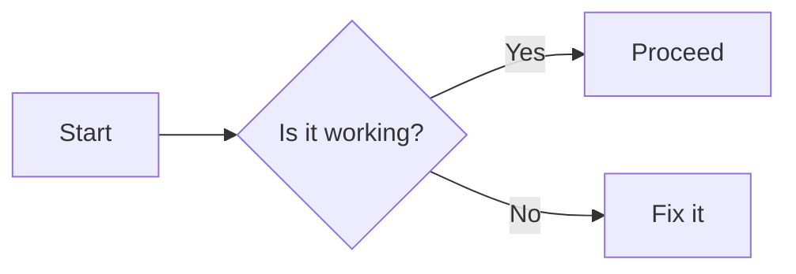

---
tags:
    - AI
    - Python
    - Philosophy
    - Coding
social:
  cards: true
---

# Welcome to My Blog

Welcome to **AreteHub**, a place where we delve into philosophy, AI, coding, relationships, and life.

---

## Table of Contents

- [Welcome to My Blog](#welcome-to-my-blog)
  - [Table of Contents](#table-of-contents)
  - [Philosophy and Stoicism](#philosophy-and-stoicism)
    - [Labels and Badges](#labels-and-badges)
    - [Admonitions](#admonitions)
  - [Artificial Intelligence](#artificial-intelligence)
    - [Inline Code](#inline-code)
    - [Code Blocks](#code-blocks)
    - [Code Blocks with Highlights](#code-blocks-with-highlights)
    - [Tabs for Multiple Languages](#tabs-for-multiple-languages)
    - [Coding Examples](#coding-examples)
    - [Lists](#lists)
    - [Table](#table)
    - [Footnotes](#footnotes)
    - [Life Lessons](#life-lessons)
    - [Blockquotes](#blockquotes)
    - [Images](#images)
    - [Emojis](#emojis)
    - [Definition List](#definition-list)
    - [Mathematical Equations](#mathematical-equations)
    - [Additional Resources](#additional-resources)
    - [Links](#links)
    - [Strikethrough and Emphasis](#strikethrough-and-emphasis)
    - [Horizontal Rule](#horizontal-rule)
    - [Mermaid Diagrams](#mermaid-diagrams)
    - [Task Lists in Content](#task-lists-in-content)
    - [Button](#button)
    - [Conclusion](#conclusion)
    - [Contact](#contact)
    - [Explanation of Features Used](#explanation-of-features-used)
    - [Tips for Using This Template](#tips-for-using-this-template)

---

## Philosophy and Stoicism

> **"The happiness of your life depends upon the quality of your thoughts."**  
> — *Marcus Aurelius*

### Labels and Badges

We explore topics in:

- Philosophy `#philosophy`
- Stoicism `#stoicism`
- Ancient Greece `#ancient-greece`

### Admonitions

!!! note "Did you know?"
    Stoicism teaches the development of self-control and fortitude as a means of overcoming destructive emotions.

!!! tip
    Reflect daily on what you can control and accept what you cannot.

!!! warning
    Excessive attachment to material things can lead to disappointment.

---

## Artificial Intelligence

Artificial Intelligence (AI) is transforming the world.

### Inline Code

To install the latest version of TensorFlow, use `pip install tensorflow`.

### Code Blocks

```python
def greet(name):
    print(f"Hello, {name}!")

greet("AreteHub")
```

### Code Blocks with Highlights

```python
def calculate_area(radius):
    area = 3.14 * radius ** 2
    return area
```

### Tabs for Multiple Languages

=== "Python"

    ``` python
    print("Hello, World!")
    ```

=== "JavaScript"

    ``` javascript
    function greet(name) {
        console.log(`Hello, ${name}!`);
    }
    ```

=== "Rust"

    ``` rust
    fn main() {
        println!("Hello, World!");
    }
    ```

### Coding Examples

### Lists

- Languages I’m Learning:
  - Python
  - Rust
  - JavaScript

### Table

| Language   | Creator         | First Appeared |
|------------|-----------------|----------------|
| Python     | Guido van Rossum| 1991           |
| Rust       | Graydon Hoare   | 2010           |
| JavaScript | Brendan Eich    | 1995           |

### Footnotes

Learning never stops.[^1]

[^1]: Especially when you’re passionate about the subject.

### Life Lessons

### Blockquotes

> “We are what we repeatedly do. Excellence, then, is not an act, but a habit.”
> — Aristotle

### Images

{ width="600" }

### Emojis

Embrace the journey of life 🚀.

### Definition List

Arete
: A Greek word meaning excellence or virtue.

Eudaimonia
: A state of being happy while living a life of virtue.

### Mathematical Equations

The equation of a circle:

$$
(x - h)^2 + (y - k)^2 = r^2
$$

Inline math example: The area of a circle is \( A = \pi r^2 \).

### Additional Resources

### Links

For more information, visit the [Material for MkDocs documentation](https://squidfunk.github.io/mkdocs-material/).

### Strikethrough and Emphasis

~~This is deprecated~~ now updated.

You can *emphasize* text or make it **bold** for importance.

### Horizontal Rule

---

### Mermaid Diagrams

Render diagrams using Mermaid:



### Task Lists in Content

- Read Meditations by Marcus Aurelius
- Complete the AI module
- Start a new coding project

### Button

[Subscribe to our newsletter](#){ .md-button }

### Conclusion

Thank you for visiting AreteHub. Feel free to share your thoughts and insights.

### Contact

- Email: contact@aretehub.com
- Twitter: @aretehub

Happy Learning!

---

### Explanation of Features Used

- **Headings (`#`, `##`, `###`)**: Organize content into sections and subsections.
- **Bold and Italics**: Emphasize text using `**bold**` and `*italics*`.
- **Blockquotes (`>`)**: Highlight quotes or important information.
- **Admonitions**: Special blocks like notes, tips, and warnings using `!!!` notation.
- **Inline Code and Code Blocks**: Display code snippets using backticks `` `code` `` and triple backticks for blocks.
- **Code Highlighting**: Use `hl_lines` to highlight specific lines in code blocks.
- **Tabs (`=== "Tab Name"`)**: Organize content into tabbed sections for different languages or perspectives.
- **Lists and Task Lists**: Create ordered and unordered lists, including checkboxes.
- **Tables**: Display data in a tabular format using pipes `|`.
- **Footnotes**: Add additional information or references at the bottom using `[^1]`.
- **Images**: Embed images with optional attributes like width.
- **Emojis**: Add emojis using Unicode characters.
- **Definition Lists**: Use terms and definitions for glossary-style lists.
- **Mathematical Equations**: Include mathematical notation using LaTeX syntax within `$$`.
- **Links**: Embed hyperlinks using `[link text](URL)`.
- **Strikethrough**: Indicate removed or outdated content using `~~text~~`.
- **Horizontal Rules (`---`)**: Separate content sections visually.
- **Mermaid Diagrams**: Create diagrams and flowcharts within code blocks labeled as `mermaid`.
- **Callouts with Icons**: Use custom admonitions with icons for emphasis.
- **Inline HTML**: Incorporate HTML elements for additional styling (used sparingly for compatibility).

---

### Tips for Using This Template

- **Customization**: Replace placeholder content with your own text, quotes, code, and images.
- **Consistency**: Maintain consistent heading levels and formatting throughout your documents.
- **Testing**: Preview your Markdown files to ensure that all features render correctly with your MkDocs theme.
- **Extensions**: Enable necessary Markdown extensions in your `mkdocs.yml` to support features like footnotes, admonitions, and Mermaid diagrams.
  
  ```yaml
  markdown_extensions:
    - admonition
    - footnotes
    - codehilite
    - pymdownx.highlight
    - pymdownx.superfences
    - pymdownx.tabbed
    - pymdownx.emoji
    - pymdownx.tasklist
    - pymdownx.tilde
    - pymdownx.arithmatex
    - pymdownx.details
    - pymdownx.mark
    - pymdownx.caret
  ```

- **Accessibility**: Use descriptive link texts and provide alt text for images to improve accessibility.

Feel free to expand upon this template to suit the specific needs of your blog. Let me know if you need further assistance with any other features or configurations!